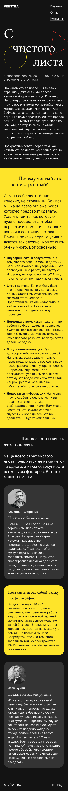

# Проект «С чистого листа»

Проект представляет собой удобный для мобильных устройств макет под названием «С чистого листа», предназначенный для того, чтобы помочь начинающим преодолеть страх начала своего первого проекта. Он демонстрирует передовые методы структурирования HTML, стилизования с помощью CSS и эффективной организации макета страницы.

## Содержание

- [Технологии](#технологии)
- [Скриншот проекта](#скриншот-проекта)
- [Ссылки](#ссылки)
- [Источники](#источники)

## Технологии

## Скриншот проекта

## Ссылки

- [Репозиторий проекта](https://github.com/LeaTrixWizzer/s-chistogo-lista.git)
- [Макет проекта](https://www.figma.com/design/UlsHre3rqsmipRD7HFnT2K/-1-%D0%A1-%D1%87%D0%B8%D1%81%D1%82%D0%BE%D0%B3%D0%BE-%D0%BB%D0%B8%D1%81%D1%82%D0%B0--Copy-?node-id=1-8&t=HQjdGTTu4gtpEeiB-0)
- [Публикация проекта](https://leatrixwizzer.github.io/s-chistogo-lista/)

## Источники

@yandex-praktikum
